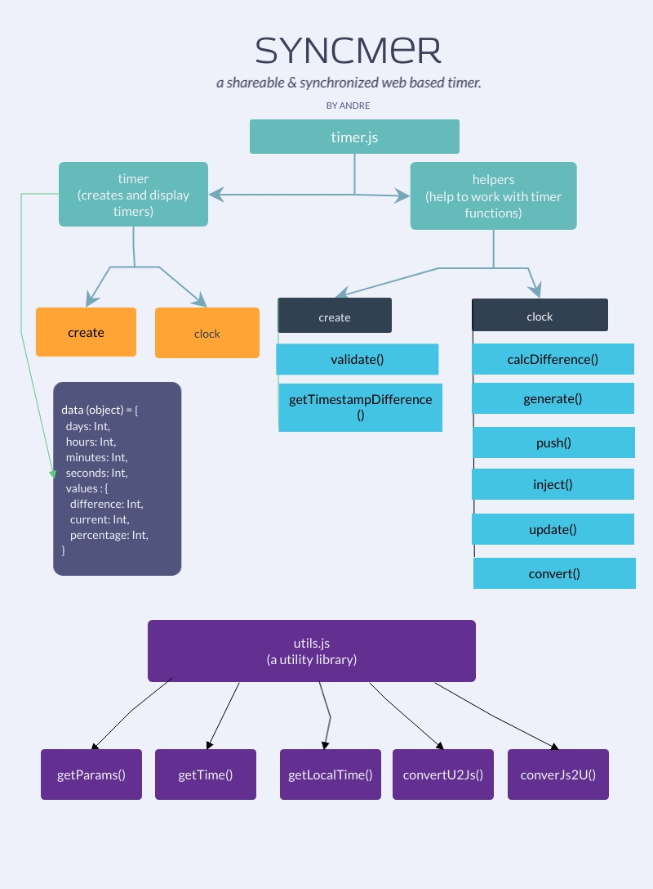

# syncmer
A synchronized web based timer, that can be shared via a link.

View Live Version: [Click here](https://pavittarx.github.io/syncmer)

## Developer Docs



###  utils.js
 
> getTime() 

It returns current local time of a given timezone.

Type: JSON Object

> getLocalTime()

It returns local time for current location. It does not use local system time for accuracy purposes. 

Type: JSON Object 

> getParams() 

It returns parameters encoded in URL. It is used to generate an already created timer. 

> convertU2Js() 

It converts Unix timestamp to Javascript Timestamp. 

> convertJs2U() 

It converts Javascript timestamp to Unix Timestamp. 

---

### timer.js 

#### **Module: Timer** 

> DATA Object 
 
 ```js
 
 timer.data = {
        days: 0,
        hours: 0,
        minutes: 0,
        seconds: 0,
        values: {
            difference: 0,
            current: 0,
            percentage: 100
        }

 ```

The data object holds the values for given time. These values change with context of operation. 

The sub object `values` holds 
* difference - It is number of seconds left for timer to expire.
* current - It contains current Unix timestamp.
* percentage - The percentage of timer is left since last reload.  

> create() 

It is the driver module for creating a timer. 

> clock()

It is the driver module for generating a timer. 

The timer is regenerated each time the page is reloaded. It does not affect the timer, the timer expires when it is supposed to. 

#### **Module: Helper** 

> helper.create.validate() 

It validates values being input by the user while creating a timer. 

> helper.create.getTimestampDifference()

It gets difference in Timestamp when the timer expires. The timestamp is a UNIX Timestamp


> helper.clock.calcDifference()

It returns difference between current time & when the timer expires. The difference is a UNIX timestamp.

> helper.clock.generate()

It generates and returns a timer object from given timestamp (UNIX) difference. 

> helper.clock.update()

It updates the timer object every second.

> helper.clock.inject()

It injects the values from timer object into the application UI. 

> helper.clock.push() 

It pushes the timer values to [timer.data](###_timer.js 
) object. 

> helper.clock.convert() 

It converts time values to 00, 01, 02 format.
